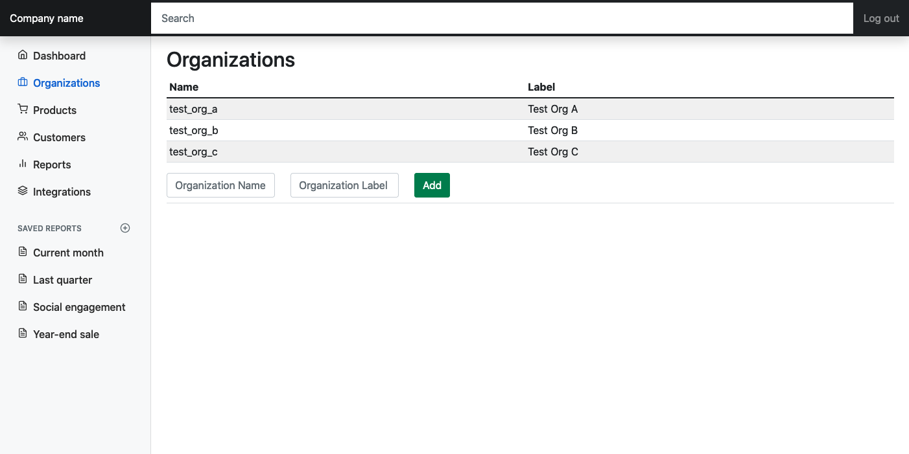

# gatsby -typescript-auth0-hasura


### [WEBSITE](https://gatsbytyauth0hasura.gtsb.io/)

Although there are plenty of Gatsby+Hasura and Gatsby+Auth0 tutorials out there, at the time of writing all were out of date and using old patterns with deprecated libraries.

This starter provides a simple Gatsby Admin page that:

1. Authenticates via [Auth0 OAuth 2.0](https://auth0.com/docs/api/authentication) to obtain a [JSON Web Token](https://auth0.com/docs/secure/tokens/json-web-tokens) (JWT); and
1. Uses the JWT in the request header to make simple GraphQL query and mutation requests to [Hasura](https://hasura.io/).

The Admin page is styled with Bootstrap and is based on a slightly modified [Dashboard Component](https://getbootstrap.com/docs/5.2/examples/). "Organizations" are used as an example for listing and creating objects/records, all other nav links serve as display placeholders only.



This starter uses:

- [TypeScript](https://www.gatsbyjs.com/docs/how-to/custom-configuration/typescript/)
- [auth0-react](https://github.com/auth0/auth0-react) for Auth0 OAuth 2.0 authentication with JWTs
- [urgql](https://github.com/FormidableLabs/urql) for the GraphQL client
- [react-bootstrap](https://github.com/react-bootstrap/react-bootstrap) and [react-feather](https://github.com/feathericons/react-feather) for styling


### Hasura Configuration

1. Follow [instructions](https://hasura.io/docs/latest/graphql/core/getting-started/index/) to set up Hasura
1. Create a simple table to store Organizations
```sql
  CREATE TABLE organizations(
    id SERIAL PRIMARY KEY,
    name TEXT,
    label TEXT
  );
```
2. Track the table from the Hasura console *Data* tab
2. Add a few test records from the Hasura console *Data* > *Insert Row* tab
2. Allow your role (configured below) to `insert` and `select` from the Hasura console *Data* > *Permissions* tab


### Auth0 Configuration

Follow [these steps](https://hasura.io/docs/latest/graphql/core/guides/integrations/auth0-jwt/) to set up Auth0 with custom claims for Hasura.


### ENV configuration

Rename `.env.example` to `.env.development` and update accordingly

| Property                  | Example Value                                   |
| ------------------------- | ----------------------------------------------- |
| GATSBY_HASURA_GRAPHQL_URL | `http://localhost:8080/v1/graphql`         |
| GATSBY_AUTH0_DOMAIN       | `<my-tenant-name>.us.auth0.com`                 |
| GATSBY_AUTH0_CLIENT_ID    | `T4WN7SBfeJ0BO6CFX2nw3k2yEECHOVMe`              |
| GATSBY_AUTH0_REDIRECT_URI | `http://localhost:8000`                         |
| GATSBY_AUTH0_AUDIENCE     | `https://<my-tenant-name>.us.auth0.com/api/v2/` |

